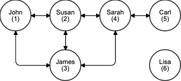

# **Venmo API**

This API was built to support a simple payment (between friends) system, similar to Venmo.

The solution is also hosted on Heroku with the following URL: https://jp-venmo.herokuapp.com

## Database 

The database architecture is represented on the next Entity Relationship Diagram:


### Friendships
How to connect users was the most crucial decision I had to make since the system is based on the relationship between them.

Given the fact that friendship is an `N:N` relationship and that I did not want to have replicated information, I decided to build a bidirectional relationship with some restrictions.

First of all, I created the `Friendship` model that contains two fields: `user_a` and `user_b` and both users are indifferent to the system, it means, it is the same being user_a or user_b, the only purpose of this model is to connect Users.

###### Restrictions

To ensure that the relationship between users reflects what I thought, I created two model validations on the Friendship model.

The first validation is to ensure that does not exist another record that connects the same users, this is what ensures that user_a and user_b are indifferent to the system.
The second, validate that a user is not connected with itself, I decided to add this restriction since it does not make sense for the system.

### Users
Users are who are using the system so I decide to represent them with two basic fields, `name` and `email`.

Given that a user could be `user_a` or `user_b` on a `Friendship`, I chose to add two `has_many` associations to manage each scenario and then I defined one more `has_many` through each friendship association to access the user's friends. Finally, I created the `friend` method that combines both friends' associations.

###### Restrictions

In order to made it a bit more real, I've added one validation on the email, so the user email should be unique.

### Payments

In my view, payments are the most important model of the system because it is what gives the main functionality, tracking payments between friends.
Each payment has a user that acts as the `sender` and another which is the `receiver`. Also, it has a timestamp that shows the creation date and the payment `amount` and `description`.

###### Restrictions

The first restriction comes from the requirements, the amount should be positive and less than $1000, so I decided to ensure it using a model validation.
Another restriction is that users can only send payments to friends and this is validated on the `create!` method of `PaymentService` which is the service used to manage the payments.

### Account
The account is responsible for knowing the user's current balance on the system, and each user should have only one account, so I modeled it as a `has_one` association in the User model. This model is created as an `after_create` callback on the user model.

##### Restrictions

As the system does not permit negative balances, I have added a model validation that ensures that balance is equal to or greater than 0.

## Endpoints

To allow different API versions, I decide that all the endpoints should start with `/api/v1/` and consequently, the folder structure reflects that prefix path.

### Users

#### `POST /api/v1/users`
Although it was not required, I decided to add this to make it easier to add new users, so I can then use postman.

**Request body**:
```json
{
    "user": {
        "name": "Juan",
        "email": "juan@example.com"
    }
}
```

#### `GET /api/v1/users/:user_id`

It was also not required, but I added it to be able to check the information.

**Response body**:
```json
{
    "user": {
        "id": 1,
        "email": "juan@example.com",
        "name": "Juan"
    }
}
```

#### `GET /api/v1/users/:user_id/feed?page=1`

This endpoint has the functionality of showing the payments made for a user and its friends.

To get all the payments information, the system executes the following steps:

1. Call the `feed_payments` method of the `PaymentService` with the user as a parameter.
1. Get the user's friends ids.
1. Get all the `Payments` where `sender` or `receiver` is on the id list.
1. Use the `PaymentPresenter` to format the payment `title` and `date`.

I chose to use the Presenter design pattern in order to avoid having huge view files or having view methods on the models.

Also as pagination was required for this endpoint, I used the [pagy](https://github.com/ddnexus/pagy) which gives this functionality, and also it is one of the fasters pagination gems.

**Response body**:
```json
{
    "feed": [
        {
            "id": 6,
            "feed_title": "John paid Susan on Dec 08, 2020 - Gift",
            "created_at": "2020-12-08T12:34:48.047Z"
        },
        {
            "id": 4,
            "feed_title": "Susan paid Sarah on Dec 08, 2020 - Gift",
            "created_at": "2020-12-08T12:10:16.833Z"
        },
       ...
    ],
    "pagy": {
        "count": 5,
        "page": 1,
        "items": 5,
        "pages": 1,
        "next": null,
        "prev": null
    }
}
```

#### `GET /api/v1/users/:user_id/balance`

Get the user's balance.

**Response body**:
```json
{
    "balance": 750.0
}
```

### Payments

#### ` POST /api/v1/users/:user_id/payments`

This endpoint allows creating a new payment between friends on the system.

**Request body**:

```json
{   
    "payment": {
        "friend_id": 2,
        "amount": 150,
        "description": "Gift"
    }
}
```

Once the server receives the request it just calls `PaymentService#create!`, using services allows me to isolate the payment creation business logic.
When the service receives the information it first checks that exists a Friendship between both users, if it does not exist, it raises a `NotFriendsError` exception.

In case that exists the Friendship, it will start a database transaction, I decided to use transactions to avoid possible errors if some step of the transaction fails.
The first step of the transaction is to reduce the user balance, then increase the user's friend balance, and finally, if everything is ok, it creates the Payment record.

To manage the user account, I created the `AccountService` and that is used to `withdraw` or `credit` a user account.

When `#whitdraw!` is called with the amount to reduce from an account, it tries to use the user balance, but in case it is not enough, it calls the `MoneyTransferService` provided with the difference between the balance and the amount to transfer.

On the other hand, `credit!` is far more simple as it only increases the user balance.

## Other comments

### Code quality
I have added some linters and code quality tools that I usually use witch are:
1. `Annotate` (Add a comment summarizing the current schema to the models and factories)
1. `Brakeman` (Checks for security vulnerabilities)
1. `Rubocop` (Code linter)
1. `Reek` (Code linter)
1. `Rails Best Practices` (Code linter)

Before I push a branch to Git, I locally run the test and a task called `code_analysis` that makes use of some of the gems mentioned previously.

### Test
I decided to write model tests that check associations, validations, and methods but I have also made some request tests on each endpoint in order to ensure great code coverage, as a result, I got 473/476 lines of code (99.37%) covered.

## Seed data
On the `seed.rb` I have added some initial models and associations, it is also loaded on Heroku.


I am also uploading a [Postman Collection](doc/Venmo_API.postman_collection.json) with some examples of possible requests.

## Git workflow
The workflow used focuses on keeping a tidy and reliable history that reflects the project’s current state.

##### Branches
I mainly used two branches `main` and `develop` to integrate the different changes.

`main` branch is created by default and reflects what is on production.
`develop` is the branch that receives the new changes on code.

##### Pull Request
In order to add new code to git, I have it using pull request, opening a new branch from develop, and then creating a pull request from that branch against develop.

##### Release
Once the code was ready to be uploaded to Heroku, I opened a release branch from `develop` and opened a pull request against `main`. Finally, I created a release tag on GitHub and pushed the `main` branch to Heroku
